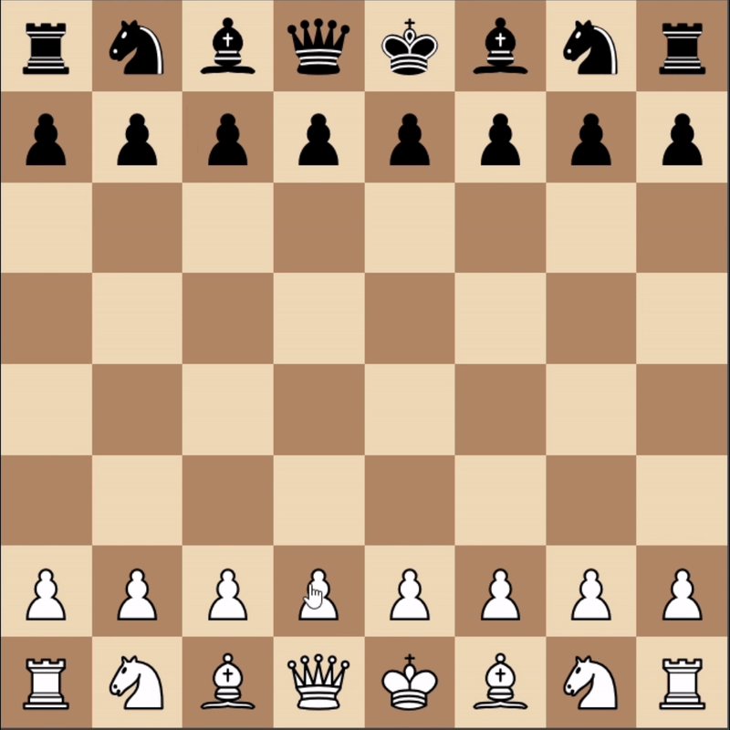

# 🏆 Gambitron - Advanced Chess AI Engine

<div align="center">



**A sophisticated chess AI engine built with modern web technologies and advanced algorithms**

[](https://gambitron.vercel.app)
[](https://reactjs.org/)
[](https://www.typescriptlang.org/)
[](https://python.org)
[](https://aws.amazon.com/lambda/)

</div>

## 🎯 Overview

Gambitron is a cutting-edge chess AI application that combines modern web development with sophisticated artificial intelligence algorithms. Built with React/TypeScript frontend and Python backend, it delivers a professional chess experience with real-time gameplay, advanced AI decision-making, and responsive design.

## ✨ Key Features

### 🧠 **Advanced AI Engine**
- **Minimax Algorithm** with Alpha-Beta Pruning for optimal move selection
- **Piece-Square Tables** for positional evaluation (Pawn, Knight, Bishop, Rook, Queen)
- **Material Evaluation** with sophisticated piece value calculations
- **Center Control** and **Pawn Advancement** bonuses
- **Bishop Pair** and **Rook Mobility** evaluation
- **King Safety** assessment for endgame scenarios

### 🎮 **Rich Gameplay Experience**
- **Real-time Chess Board** with drag-and-drop piece movement
- **Move Validation** ensuring only legal moves are allowed
- **Pawn Promotion** with interactive piece selection dialog
- **Game State Persistence** with localStorage integration
- **Move Highlighting** showing valid moves for selected pieces
- **Game History** tracking and replay capabilities

### ⏱️ **Professional Timing System**
- **Dual Timers** for both player and AI
- **Configurable Time Controls** (1-30 minutes)
- **Visual Timer Indicators** with active/inactive states
- **Time Persistence** across browser sessions
- **Real-time Updates** with smooth countdown animations

### 📱 **Responsive Design**
- **Desktop Layout** with sidebar game information
- **Mobile Layout** optimized for touch devices
- **Adaptive UI** that works on all screen sizes
- **Modern Dark Theme** with professional styling
- **Social Media Integration** with GitHub, LinkedIn, and LeetCode links

### 🔧 **Developer Features**
- **Admin Panel** for FEN position loading and testing
- **Error Handling** with retry mechanisms
- **API Integration** with AWS Lambda backend
- **CORS Support** for cross-origin requests
- **TypeScript** for type safety and better development experience

## 🏗️ Architecture

### Frontend Architecture

```
frontend/
├── src/
│   ├── components/
│   │   ├── board/
│   │   │   ├── Board.tsx          # Main game logic and state management
│   │   │   └── Board.css          # Board-specific styles
│   │   ├── tile/
│   │   │   ├── tile.tsx           # Individual chess square component
│   │   │   └── tile.css           # Tile styling
│   │   ├── ChessBoard.tsx         # Chess board rendering
│   │   ├── ChessPiece.tsx         # Piece rendering and interactions
│   │   ├── DesktopLayout.tsx      # Desktop-specific layout
│   │   ├── MobileLayout.tsx       # Mobile-responsive layout
│   │   ├── GameDialogs.tsx        # Modal dialogs (promotion, start, endgame)
│   │   ├── GameInfo.tsx           # Game information display
│   │   ├── Timer.tsx              # Timer component
│   │   ├── MobileTimer.tsx        # Mobile timer variant
│   │   └── SocialLinks.tsx        # Social media links
│   ├── App.tsx                    # Main application component
│   └── main.tsx                   # Application entry point
├── public/
│   ├── pieces/                    # Chess piece SVG assets
│   └── readme/                    # Documentation assets
└── package.json                   # Dependencies and scripts
```

### Backend Architecture

```
lambda-backend/
├── backend.py                     # FastAPI application with chess logic
├── lambda.py                      # AWS Lambda handler
├── lambda-layer/
│   └── python/
│       └── chess/                 # Python chess library
│           ├── __init__.py
│           ├── engine.py          # Chess engine implementation
│           ├── gaviota.py         # Endgame tablebase support
│           ├── pgn.py             # PGN format support
│           ├── polyglot.py        # Opening book support
│           ├── svg.py             # SVG rendering
│           ├── syzygy.py          # Syzygy tablebase
│           └── variant.py         # Chess variant support
└── requirements.txt               # Python dependencies
```

## 🧮 AI Algorithm Deep Dive

### Minimax with Alpha-Beta Pruning

The core AI engine uses the minimax algorithm enhanced with alpha-beta pruning for optimal performance:

```python
def minimax(board_state: chess.Board, depth: int, alpha: float, beta: float, is_maximizing: bool) -> float:
    if depth == 0 or board_state.is_game_over():
        return evaluate_board_state(board_state)
    
    if is_maximizing:
        max_eval = float('-inf')
        for move in board_state.legal_moves:
            board_state.push(move)
            move_eval = minimax(board_state, depth - 1, alpha, beta, False)
            board_state.pop()
            max_eval = max(max_eval, move_eval)
            alpha = max(alpha, move_eval)
            if beta <= alpha:
                break  # Alpha-beta pruning
        return max_eval
    else:
        # Minimizing player logic...
```

### Evaluation Function

The AI evaluates positions using multiple sophisticated criteria:

- **Material Values**: Pawn (100), Knight (320), Bishop (330), Rook (500), Queen (900), King (20000)
- **Piece-Square Tables**: Positional bonuses for each piece type
- **Center Control**: Bonus for controlling central squares
- **Pawn Advancement**: Rewards for advanced pawns
- **Bishop Pair**: Bonus for having both bishops
- **Rook Mobility**: Evaluation based on rook movement options
- **King Safety**: Endgame king positioning

### Move Ordering

The AI optimizes move selection by:
1. **Capture Moves First**: Prioritizes moves that capture pieces
2. **Material Value Sorting**: Orders captures by piece value
3. **Alpha-Beta Pruning**: Eliminates branches that won't affect the final decision

## 🚀 Getting Started

### Prerequisites

- **Node.js** (v14 or later)
- **Python 3.x**
- **Git**

### Frontend Setup

1. **Clone the repository**:
   ```bash
   git clone https://github.com/Cyrus-Krispin/gambitron
   cd gambitron/frontend
   ```

2. **Install dependencies**:
   ```bash
   npm install
   ```

3. **Start development server**:
   ```bash
   npm run dev
   ```

4. **Open your browser** to `http://localhost:5173`

### Backend Setup

1. **Navigate to backend directory**:
   ```bash
   cd lambda-backend
   ```

2. **Create virtual environment**:
   ```bash
   python -m venv venv
   ```

3. **Activate virtual environment**:
   ```bash
   # Windows
   venv\Scripts\activate
   
   # macOS/Linux
   source venv/bin/activate
   ```

4. **Install dependencies**:
   ```bash
   pip install -r requirements.txt
   ```

5. **Run the backend**:
   ```bash
   fastapi dev backend.py
   ```

## 🎮 How to Play

1. **Start a New Game**: Click "New Game" and select your preferred time control
2. **Make Moves**: Click on a piece, then click on a valid destination square
3. **Pawn Promotion**: When a pawn reaches the end, choose your promotion piece
4. **Timer Management**: Watch the countdown timers for both you and the AI
5. **Game Over**: The game automatically detects checkmate, stalemate, or timeouts

## 🔧 Technical Implementation

### State Management

The application uses React hooks for state management:
- **useState** for local component state
- **useEffect** for side effects and API calls
- **useMemo** for performance optimization
- **Custom hooks** for game logic encapsulation

### API Integration

The frontend communicates with the backend via REST API:
- **POST /move**: Get AI's next move
- **POST /evaluate**: Evaluate current board position
- **Error Handling**: Comprehensive error management with retry mechanisms

### Performance Optimizations

- **Move Generation**: Efficient legal move generation using chess.js
- **Alpha-Beta Pruning**: Reduces search tree size by up to 50%
- **Move Ordering**: Prioritizes promising moves for better pruning
- **Memoization**: Caches expensive calculations
- **Lazy Loading**: Loads components only when needed

## 🛠️ Development

### Available Scripts

```bash
# Frontend
npm run dev          # Start development server
npm run build        # Build for production
npm run preview      # Preview production build
npm run lint         # Run ESLint

# Backend
fastapi dev backend.py    # Start development server
python lambda.py          # Test Lambda function locally
```

### Code Structure

- **TypeScript**: Full type safety throughout the application
- **ESLint**: Code quality and consistency enforcement
- **Tailwind CSS**: Utility-first CSS framework
- **Material-UI**: Component library for dialogs and UI elements

## 🌐 Deployment

### Frontend (Vercel)
- **Automatic Deployment**: Connected to GitHub repository
- **Preview Deployments**: Automatic previews for pull requests
- **Custom Domain**: Available at [gambitron.vercel.app](https://gambitron.vercel.app)

### Backend (AWS Lambda)
- **Serverless Architecture**: Scales automatically with demand
- **Lambda Layers**: Chess library packaged as a layer
- **API Gateway**: RESTful API endpoint configuration

## 📊 Performance Metrics

- **AI Response Time**: < 2 seconds for most positions
- **Search Depth**: Configurable depth (typically 3-4 plies)
- **Memory Usage**: Optimized for Lambda constraints
- **Frontend Bundle**: < 1MB gzipped
- **Mobile Performance**: 60fps animations on modern devices

## 🤝 Contributing

We welcome contributions! Please see our contributing guidelines:

1. **Fork the repository**
2. **Create a feature branch**: `git checkout -b feature/amazing-feature`
3. **Commit your changes**: `git commit -m 'Add amazing feature'`
4. **Push to the branch**: `git push origin feature/amazing-feature`
5. **Open a Pull Request**

## 📝 License

This project is licensed under the MIT License - see the [LICENSE](LICENSE) file for details.

## 🙏 Acknowledgments

- **Chess.js** - JavaScript chess library
- **Python-chess** - Python chess library
- **React** - Frontend framework
- **FastAPI** - Backend framework
- **AWS Lambda** - Serverless computing platform
- **Vercel** - Frontend deployment platform

## 📞 Contact

**Cyrus Krispin**
- GitHub: [@Cyrus-Krispin](https://github.com/Cyrus-Krispin)
- LinkedIn: [cyruskrispin](https://www.linkedin.com/in/cyruskrispin/)
- LeetCode: [cyrus-krispin](https://leetcode.com/u/cyrus-krispin/)

---

<div align="center">

**Ready to challenge Gambitron?** [Play Now!](https://gambitron.vercel.app)

*Built with ❤️ and advanced AI algorithms*

</div>