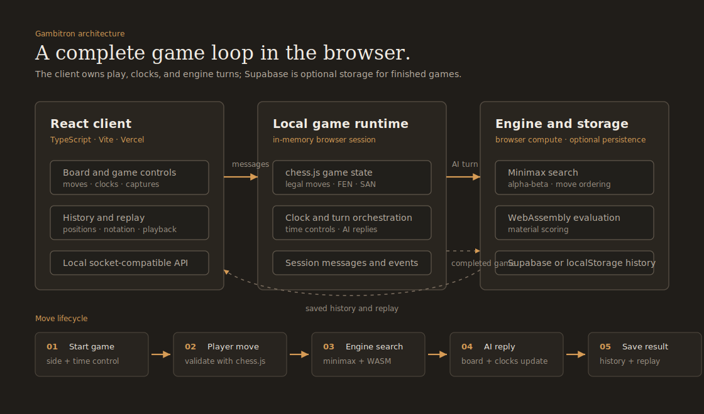

# Gambitron

<div align="center">


[](https://gambitron.vercel.app)

**Chess AI built with React, TypeScript, and WebAssembly**

[](https://reactjs.org/)
[](https://www.typescriptlang.org/)
[](https://webassembly.org/)

</div>

---

## Features

- Play as White or Black against a browser-local minimax AI
- WebAssembly-backed material evaluation with alpha-beta pruning
- Configurable time controls with local clock ownership
- Supabase-backed game history and move-by-move replay, with localStorage fallback

## How It Works



The browser handles the board UI, legal-move hints, clocks, AI turns, and replay controls. Live games run through a local socket-compatible runtime, so there is no backend server, EC2 instance, Docker image, or network WebSocket to run.

The engine uses `chess.js` for legal move generation and a small embedded WebAssembly module for hot-path material scoring. Completed games are written from the frontend to Supabase tables and cached in `localStorage` as an offline fallback.

**AI evaluation factors:** WASM-scored material, legal mobility, capture ordering, promotions, checks, and mate detection.

Editable diagram source: [frontend/public/gambitron-architecture.drawio](frontend/public/gambitron-architecture.drawio)

## Quick Start

```bash
cd frontend && npm install && npm run dev
```

## Supabase

Run `frontend/supabase/schema.sql` in the Supabase SQL Editor, then set these frontend environment variables:

```bash
VITE_SUPABASE_URL=https://your-project.supabase.co
VITE_SUPABASE_ANON_KEY=your-anon-key
```

No server-side Supabase secret is used. The browser writes completed games with the anon key under the row-level security policies in `frontend/supabase/schema.sql`.

## Engine Strength Gate

The browser engine is checked against a Git baseline before it ships. The gate
compares tactical positions and paired, color-reversed self-play at an equal
search-time budget:

```bash
cd frontend
npm run test:engine
```

To compare a committed candidate against its parent revision, run:

```bash
ENGINE_BASELINE=HEAD^ npm run test:engine
```

Pull requests run the same comparison automatically against their base branch.

## License

MIT
