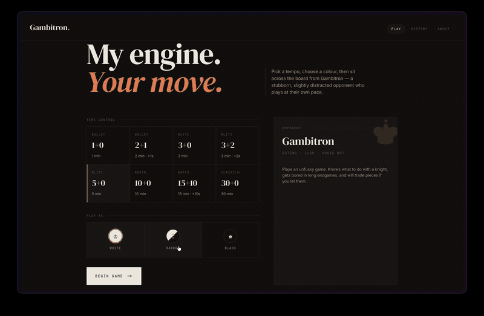
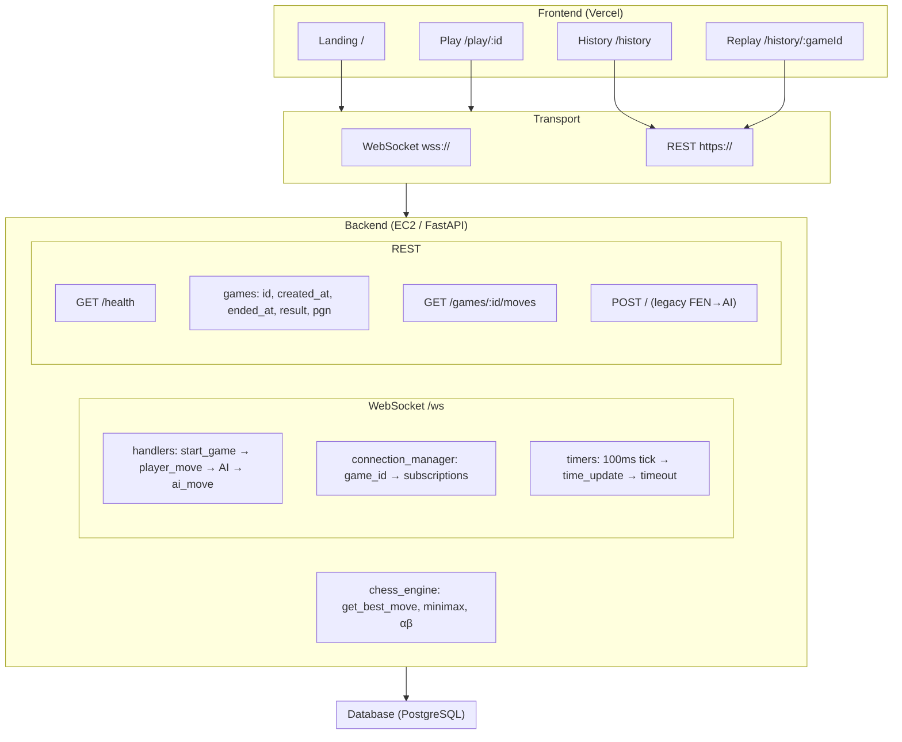
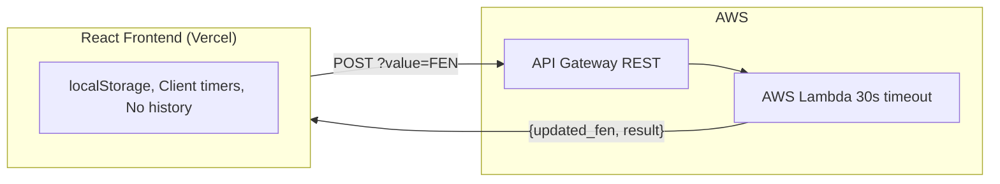
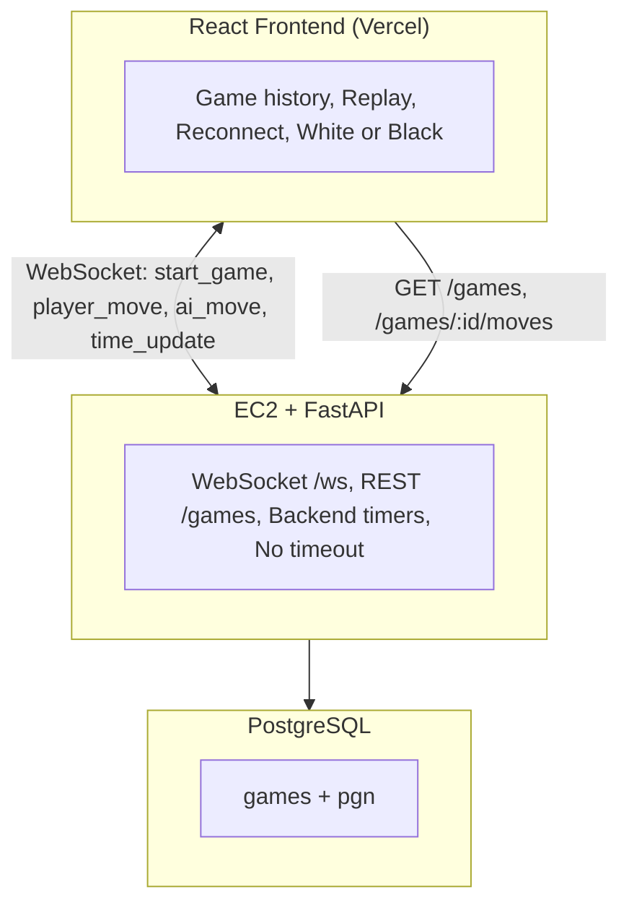
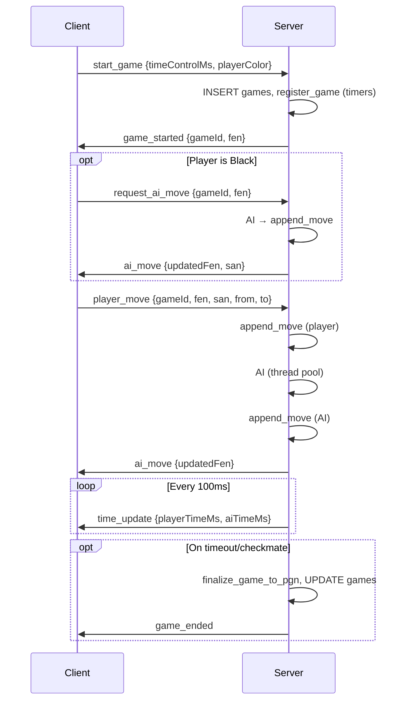
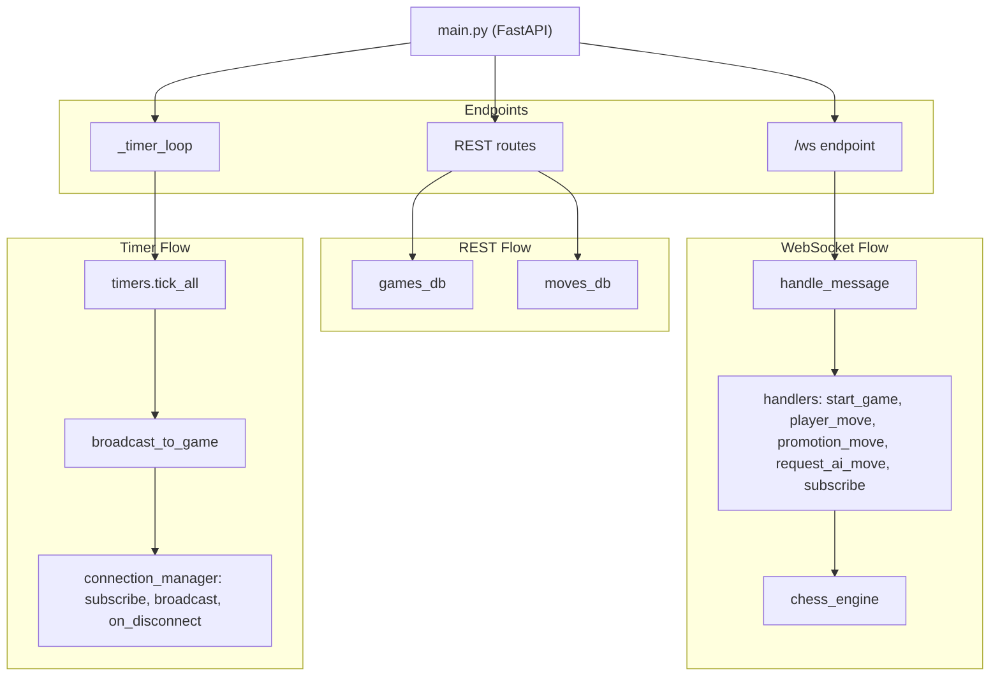
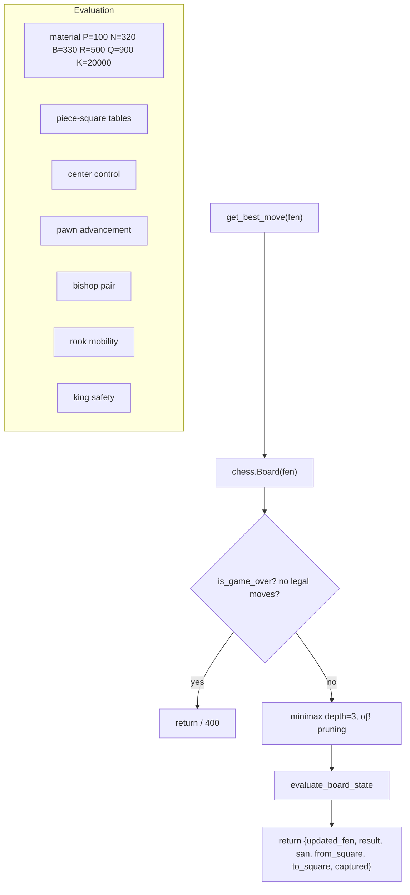

# 🏆 Gambitron

<div align="center">



[](https://gambitron.vercel.app)

**Chess AI · Minimax & αβ pruning · WebSocket · Game history**

[](https://reactjs.org/)
[](https://www.typescriptlang.org/)
[](https://python.org)
[](https://fastapi.tiangolo.com/)

</div>

---

## Architecture Overview


```mermaid
flowchart TB
    subgraph Frontend["Frontend (Vercel)"]
        Landing["Landing /"]
        Play["Play /play/:id"]
        History["History /history"]
        Replay["Replay /history/:gameId"]
    end

    subgraph Transport["Transport"]
        WS["WebSocket wss://"]
        REST["REST https://"]
    end

    subgraph Backend["Backend (EC2 / FastAPI)"]
        subgraph WSModule["WebSocket /ws"]
            Handlers["handlers: start_game → player_move → AI → ai_move"]
            ConnMgr["connection_manager: game_id → subscriptions"]
            Timers["timers: 100ms tick → time_update → timeout"]
        end
        subgraph RESTModule["REST"]
            Health["GET /health"]
            Games["GET /games, /games/:id"]
            Moves["GET /games/:id/moves"]
            Legacy["POST / (legacy FEN→AI)"]
        end
        Engine["chess_engine: get_best_move, minimax, αβ"]
    end

    subgraph DB["Database (PostgreSQL)"]
        Games["games: id, created_at, ended_at, result, pgn"]
    end

    Landing --> Transport
    Play --> Transport
    History --> REST
    Replay --> REST
    Transport --> Backend
    Backend --> DB
```

---

## 1.0 → 1.1 Architecture Migration

### 1.0 Architecture (Legacy)


```mermaid
flowchart LR
    subgraph Client["React Frontend (Vercel)"]
        FE["localStorage, Client timers, No history"]
    end

    subgraph AWS["AWS"]
        APIGW["API Gateway REST"]
        Lambda["AWS Lambda 30s timeout"]
    end

    Client -->|"POST ?value=FEN"| APIGW
    APIGW --> Lambda
    Lambda -->|"{updated_fen, result}"| Client
```

- ❌ 30s API Gateway timeout
- ❌ No game history / replay
- ❌ Stateless: every move = new HTTP request
- ❌ Client-owned timers (could desync)
- ❌ No reconnection / session recovery

### 1.1 Architecture (Current)


```mermaid
flowchart TB
    subgraph Client["React Frontend (Vercel)"]
        C["Game history, Replay, Reconnect, White or Black"]
    end

    subgraph Backend["EC2 + FastAPI"]
        B["WebSocket /ws, REST /games, Backend timers, No timeout"]
    end

    subgraph DB["PostgreSQL"]
        D["games + pgn"]
    end

    Client <-->|"WebSocket: start_game, player_move, ai_move, time_update"| Backend
    Client -->|"GET /games, /games/:id/moves"| Backend
    Backend --> DB
```

- ✅ No timeout (persistent connection)
- ✅ Game history + replay (PGN)
- ✅ Server-owned timers (authoritative)
- ✅ Reconnect + subscribe for session recovery
- ✅ Play as White or Black (request_ai_move for Black)
- ✅ Capture display, material diff
- ✅ Admin panel (REST fallback)

### Migration Summary

| Aspect | 1.0 | 1.1 |
|--------|-----|-----|
| **Transport** | REST POST per move | WebSocket (bidirectional) |
| **Backend** | AWS Lambda | EC2 + FastAPI |
| **Timeout** | 30s (API Gateway) | None (persistent) |
| **Game state** | Client only (localStorage) | Server + DB |
| **Timers** | Client (setInterval) | Server (100ms tick, broadcast) |
| **History** | None | GET /games, replay from PGN |
| **Reconnect** | N/A | subscribe + game_state |
| **Color choice** | White only | White or Black |

---

## Data Flow Diagrams

### WebSocket Message Flow


```mermaid
sequenceDiagram
    participant C as Client
    participant S as Server

    C->>S: start_game {timeControlMs, playerColor}
    S->>S: INSERT games, register_game (timers)
    S->>C: game_started {gameId, fen}

    opt Player is Black
        C->>S: request_ai_move {gameId, fen}
        S->>S: AI → append_move
        S->>C: ai_move {updatedFen, san}
    end

    C->>S: player_move {gameId, fen, san, from, to}
    S->>S: append_move (player)
    S->>S: AI (thread pool)
    S->>S: append_move (AI)
    S->>C: ai_move {updatedFen}

    loop Every 100ms
        S->>C: time_update {playerTimeMs, aiTimeMs}
    end

    opt On timeout/checkmate
        S->>S: finalize_game_to_pgn, UPDATE games
        S->>C: game_ended
    end
```

### Backend Component Diagram


```mermaid
flowchart TB
    Main["main.py (FastAPI)"]

    subgraph Endpoints["Endpoints"]
        WS["/ws endpoint"]
        REST["REST routes"]
        Timer["_timer_loop"]
    end

    subgraph WSFlow["WebSocket Flow"]
        HM["handle_message"]
        Handlers["handlers: start_game, player_move, promotion_move, request_ai_move, subscribe"]
        Engine["chess_engine"]
    end

    subgraph RESTFlow["REST Flow"]
        GamesDB["games_db"]
        MovesDB["moves_db"]
    end

    subgraph TimerFlow["Timer Flow"]
        Tick["timers.tick_all"]
        Broadcast["broadcast_to_game"]
        ConnMgr["connection_manager: subscribe, broadcast, on_disconnect"]
    end

    Main --> WS
    Main --> REST
    Main --> Timer
    WS --> HM
    HM --> Handlers
    Handlers --> Engine
    REST --> GamesDB
    REST --> MovesDB
    Timer --> Tick
    Tick --> Broadcast
    Broadcast --> ConnMgr
```

---

## Frontend Structure

```
frontend/src/
├── App.tsx                 # Routes: /, /play/:id, /history, /history/:id, /about, /admin
├── hooks/
│   └── useGame.ts         # WebSocket client, game state, timers, move handling
├── lib/
│   └── websocket.ts       # createReconnectingSocket, sendMessage, types
├── pages/
│   ├── Landing.tsx        # Time control + color pick → /play/new?minutes=&color=
│   ├── Play.tsx           # ChessBoard, TimerCard, CaptureDisplay, Dialogs
│   ├── History.tsx        # GET /games → list → link to /history/:id
│   ├── Replay.tsx         # GET /games/:id/moves → step-through replay
│   ├── About.tsx          # Architecture, tech stack
│   └── Game.tsx           # Admin: FEN loader, REST fallback
└── components/
    ├── ChessBoard.tsx     # 8×8 grid, piece rendering, click-to-move
    ├── ChessPiece.tsx     # Piece SVG, drag state
    ├── TimerCard.tsx      # MM:SS countdown, active state
    ├── CaptureDisplay.tsx  # Captured pieces, material diff
    ├── Dialogs.tsx        # Promotion, endgame, error
    └── Layout.tsx         # Header nav (History, About)
```

---

## Backend Structure

```
backend/
├── main.py                # FastAPI, CORS, /ws, REST, startup/shutdown
├── chess_engine.py        # get_best_move(fen), minimax, evaluate
├── config.py              # ALLOWED_ORIGINS, DATABASE_URL, PGN_STORAGE_DIR
├── db/
│   ├── connection.py      # asyncpg pool, create_pool, close_pool
│   ├── games.py           # create_game, get_game, list_games, update_game_ended
│   └── moves.py           # append_move, get_moves_by_game, finalize_game_to_pgn
├── websocket/
│   ├── handlers.py        # handle_start_game, player_move, promotion_move,
│   │                     # request_ai_move, subscribe, handle_message
│   ├── connection_manager.py  # subscribe, unsubscribe, broadcast_to_game
│   └── timers.py          # register_game, tick_all, apply_elapsed, timeout
└── migrations/
    └── schema.sql         # games table
```

---

## AI Engine (chess_engine.py)


```mermaid
flowchart TB
    Start["get_best_move(fen)"]
    Board["chess.Board(fen)"]
    Check{"is_game_over? no legal moves?"}
    Return1["return / 400"]
    Minimax["minimax depth=3, αβ pruning"]
    Eval["evaluate_board_state"]
    Return2["return {updated_fen, result, san, from_square, to_square, captured}"]

    Start --> Board
    Board --> Check
    Check -->|yes| Return1
    Check -->|no| Minimax
    Minimax --> Eval
    Eval --> Return2

    subgraph EvalDetails["Evaluation"]
        M["material P=100 N=320 B=330 R=500 Q=900 K=20000"]
        PST["piece-square tables"]
        CC["center control"]
        PA["pawn advancement"]
        BP["bishop pair"]
        RM["rook mobility"]
        KS["king safety"]
    end
```

---

## Quick Start

```bash
# Frontend
cd frontend && npm install && npm run dev

# Backend
cd backend && python -m venv venv && source venv/bin/activate
pip install -r requirements.txt
fastapi dev main.py
```

Env: `VITE_backend`, `VITE_WS_URL` (frontend); `DATABASE_URL`, `ALLOWED_ORIGINS` (backend).

---

## License

MIT
