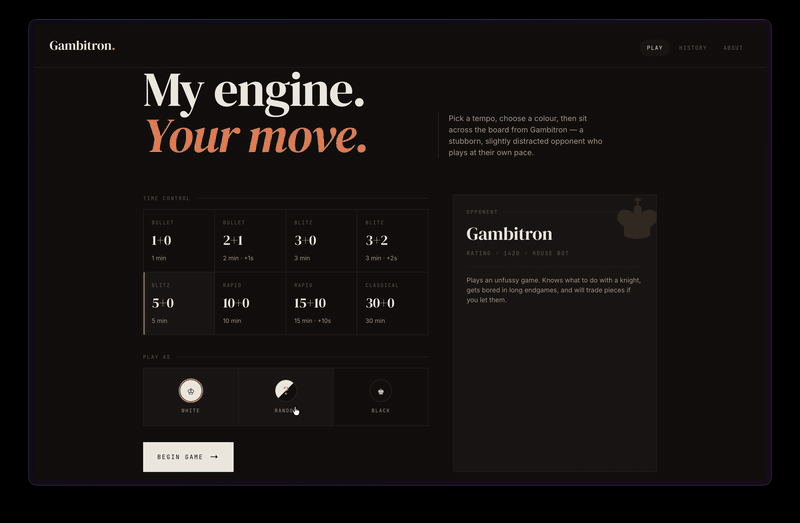
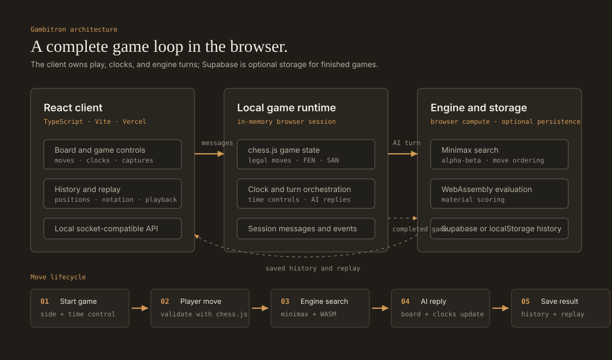

# Gambitron

<div align="center">



[](https://gambitron.vercel.app)

**Chess AI built with React, TypeScript, and WebAssembly**

[](https://reactjs.org/)
[](https://www.typescriptlang.org/)
[](https://webassembly.org/)

</div>

---

## Features

- Play as White or Black against a browser-local minimax AI
- WebAssembly-backed material evaluation with alpha-beta pruning
- Configurable time controls with local clock ownership
- Supabase-backed game history and move-by-move replay, with localStorage fallback

## How It Works



The browser handles the board UI, legal-move hints, clocks, AI turns, and replay controls. Live games run through a local socket-compatible runtime, so there is no backend server, EC2 instance, Docker image, or network WebSocket to run.

The engine uses `chess.js` for legal move generation and a small embedded WebAssembly module for hot-path material scoring. Active and completed games are stored privately in the browser.

**AI evaluation factors:** WASM-scored material, legal mobility, capture ordering, promotions, checks, and mate detection.

Editable diagram source: [frontend/public/gambitron-architecture.drawio](frontend/public/gambitron-architecture.drawio)

## Quick Start

```bash
cd frontend && npm install && npm run dev
```

## Game history

Completed games and active-game recovery are stored privately in the browser. Remote history is intentionally disabled until an authenticated, owner-scoped storage design is available. Do not deploy `frontend/supabase/schema.sql`; it is retained only as legacy migration context.

Production release, preview verification, monitoring, and rollback procedures are documented in [docs/production-runbook.md](docs/production-runbook.md).

## Engine Strength Gate

The browser engine is checked against a Git baseline before it ships. The gate
compares tactical positions and paired, color-reversed self-play at an equal
deterministic node budget; its wall-clock limit is intentionally generous so
slower CI machines do not alter the result:

```bash
cd frontend
npm run test:engine
```

To compare a committed candidate against its parent revision, run:

```bash
ENGINE_BASELINE=HEAD^ npm run test:engine
```

Pull requests run the same comparison automatically against their base branch.

## License

MIT
